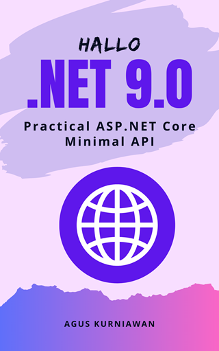

# Hallo .NET 9.0: Practical ASP.NET Core Minimal API

**Hallo .NET 9.0: Practical ASP.NET Core Minimal API** is your comprehensive guide to mastering modern web API development using Microsoft's latest .NET 9.0 framework. This practical book takes you on a hands-on journey through the innovative world of ASP.NET Core Minimal APIs, showcasing how to build efficient, lightweight, and high-performance web services with minimal code and maximum functionality. From basic "Hello World" applications to advanced deployment scenarios, each chapter builds upon the previous one, ensuring a smooth learning curve for developers of all skill levels.

The book emphasizes real-world application through seven carefully crafted exercises that cover essential aspects of modern API development. You'll explore RESTful service creation, implement the new built-in OpenAPI documentation (replacing Swagger), develop calculator services, handle file operations, and master exception handling and logging. The final chapters delve into middleware, filters, and comprehensive deployment strategies including containerization with Docker, cloud deployment, and performance monitoring.

Written with a focus on .NET 9.0's latest features and improvements, this book serves as both a learning resource for newcomers and a practical reference for experienced developers transitioning to the minimal API approach. The hands-on labs, complete with HTTP testing files and detailed explanations, ensure you gain practical experience that can be immediately applied to real-world projects.

You will learn:

• **Comprehensive coverage of .NET 9.0 Minimal APIs** - From basic concepts to advanced implementation patterns
• **Built-in OpenAPI integration** - Learn the new standardized approach to API documentation that replaces Swagger
• **Hands-on practical exercises** - Seven progressive labs with complete source code and testing scenarios
• **Modern deployment strategies** - Docker containerization, cloud deployment, and performance monitoring techniques
• **RESTful service development** - Complete CRUD operations, file handling, and advanced HTTP request processing
• **Production-ready techniques** - Exception handling, logging, middleware implementation, and security best practices
• **Developer productivity tools** - Integration with REST Client extensions, testing methodologies, and debugging approaches

## List of Exercises

Here's a list of the exercises included in the book:

* Exercise 1: Hello World - ASP.NET Core Minimal API
* Exercise 2: RESTful Service Request and Response
* Exercise 3: Swagger API Documentation
* Exercise 4: Building a Calculator Service
* Exercise 5: Upload and Download File Web API
* Exercise 6: Exception Handling and Logging
* Exercise 7: Middleware and Filters
* Exercise 8: EF Core 9.0 Code First and ASP.NET Core Minimal API
* Exercise 9: EF Core 9.0 Database First and ASP.NET Core Minimal API
* Exercise 10: Database Transaction
* Exercise 11: NoSQL Database and ASP.NET Core Minimal API
* Exercise 12: Authentication and Authorization
* Exercise 13: Role-Based Access Control (RBAC)
* Exercise 14: Data Privacy and Protection
* Exercise 15: Rate Limiting and Throttling
* Exercise 16: Configuring CORS in ASP.NET Core 9.0 Minimal API
* Exercise 17: Health Check and Monitoring
* Exercise 18: Deploying to Web Server IIS
* Exercise 19: Deploying to Linux Server with Nginx
* Exercise 20: Deploying to Container Platforms

## How to Buy

You can buy this book the following online stores:

* Google Play Books: https://play.google.com/store/books/details?id=dN9_EQAAQBAJ
* Lulu: https://www.lulu.com/shop/agus-kurniawan/hallo-net-90-practical-aspnet-core-minimal-api/ebook/product-yvg86pg.html
* Apple iBookstore: http://books.apple.com/us/book/id6751894010
* Leanpub: https://leanpub.com/aspnet9minimalapi 
* Others: https://books2read.com/u/baOPj2 
